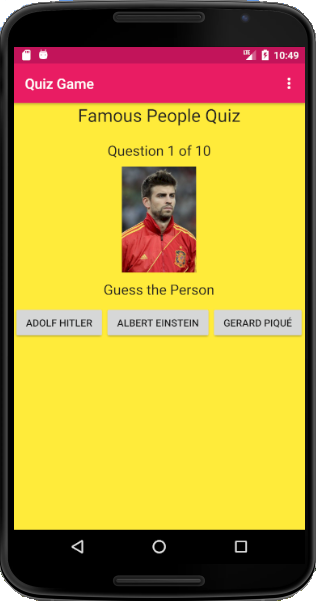
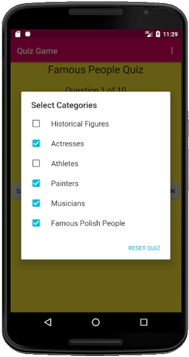

# Famous People Quiz Game
> Quiz game app for Android written in Java. Guess who is in the picture!

## Table of contents
* [General info](#general-info)
* [Motivation](#motivation)
* [Screenshots](#screenshots)
* [Built with](#built-with)
* [Setup](#setup)
* [Status](#status)
* [Inspiration](#inspiration)

## General info
The main goal of "Famous People Quiz Game" is to guess 10 famous people shown in the pictures. Pictures of respective figures are randomly selected from 6 categories. User can choose and mix categories at their discretion.  

## Motivation
I have created this project to improve my programming skills and learn how to build Android applications.

## Screenshots

## Built with
* Android Studio
* Java
* XML

## Setup
coming soon

## Status 
_in progress_

## Inspiration
Project inspired by ANDROID™ FOR PROGRAMMERS
AN APP-DRIVEN APPROACH
DEITEL® DEVELOPER SERIES

